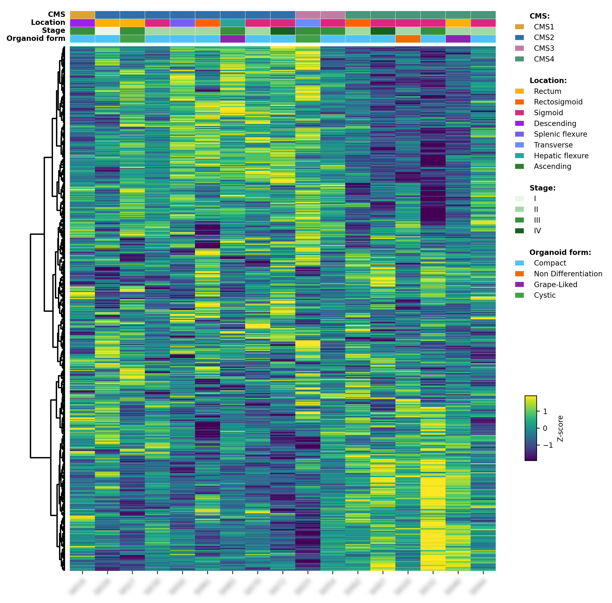

## Molecular subtype identification from NanoString nCounter data

This pipeline predicts the consensus molecular subtype (CMS) of colorectal cancer samples from a targeted ~770-gene **NanoString nCounter** panel (18 patients), and cross-checks those calls against TCGA using batch-corrected UMAP and a clustered expression heatmap.

### Pipeline steps

| Script | Purpose |
| --- | --- |
| `001_check_geneset_overlap.py` | Sanity-check overlap between the NanoString panel and the sibling project's RNA-seq gene set |
| `002_raw_counts_to_tpm.R` | Drop QC control probes, length-normalize raw counts to TPM (Ensembl biomaRt), and log2-transform |
| `003_cms_prediction.R` | Score MSigDBv7 functional spectra and classify each sample into CMS1–4 with a DeepCC model trained on CRC TCGA |
| `004_batch_merging.R` | ComBat batch-correct the NanoString log2-TPM matrix against the TCGA log2-TPM reference |
| `005_supervised_umap.R` | PCA30 → supervised UMAP of the merged matrix, colored by CMS |
| `101_supervised_umap_17_samples.R` | Same UMAP recipe, restricted to the 17-sample cohort shared with the `308-CMS-AND-ONCOPLOT` project |
| `102_heatmap_17_samples.py` | Bi-clustered expression heatmap with CMS/clinical annotations for the 17-sample cohort |

Each step reads the previous step's output from `results/`; raw data lives in `data/` (both are git-ignored). See the Dockerfile for the R/Python/conda environment used to run DeepCC and biomaRt.